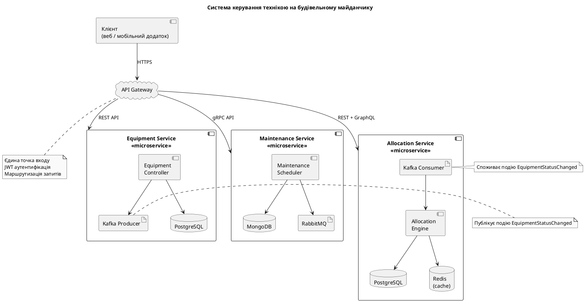

# **ЛАБОРАТОРНА РОБОТА № 2**

**Тема:** Проєктування мікросервісної архітектури 

**Мета:** Навчитися декомпозувати систему на мікросервіси

**Короткі теоретичні відомості**

Мікросервісна архітектура — це підхід до проєктування програмних систем, де застосунок розділяється на незалежні сервіси, кожен з яких виконує одну бізнес-функцію та взаємодіє через API (REST або gRPC). Кожен мікросервіс має власний життєвий цикл, базу даних і розгортається незалежно. На відміну від моноліту, мікросервіси дозволяють окремо масштабувати та оновлювати частини системи.

Ключові принципи: незалежність, слабке зв’язування, автономність даних, самостійне розгортання. Використовуються bounded context для визначення меж сервісів, "database per service" для уникнення конфліктів. Взаємодія — синхронна (HTTP) або асинхронна (брокери як RabbitMQ, Kafka).

Переваги: паралельна розробка, масштабування, стійкість до відмов, гнучкість технологій. Недоліки: складність взаємодії, моніторинг, DevOps-вимоги.

У прикладі системи управління будівельними об’єктами сервіси: "Проєкти", "Працівники", "Техніка", "Звіти", "Сповіщення" — взаємодіють через API Gateway.

Для документування використовують C4 Model або UML-диаграми.

**Завдання до роботи згідно варіанту**

Предметна область: Система керування технікою на будівельному майданчику. Вибрано 3 основних мікросервіси:

Equipment Service – облік та стан всієї техніки.

Maintenance Service – планування та облік ТО, ремонтів, простоїв

Allocation Service – розподіл техніки по об’єктах/ділянках, бронювання, графік використання

**Завдання**

**1. Визначити 2–3 основних мікросервісів (наприклад: управління працівниками, обладнанням, календарем робіт, оплатами, аналітика).**  

Equipment Service – облік та стан всієї техніки.

Maintenance Service – планування та облік ТО, ремонтів, простоїв

Allocation Service – розподіл техніки по об’єктах/ділянках, бронювання, графік використання

**2. Для кожного мікросервісу визначити базу даних, API, черги повідомлень.** 

|**Мікросервіс**|**База даних**|**API**|**Черги**|
| :-: | :-: | :-: | :-: |
|Equipment Service|PostgreSQL (реляційна)|REST|Kafka (публікує події EquipmentStatusChanged)|
|Maintenance Service|MongoDB (гнучкі документи історії)|gRPC (високе навантаження від датчиків)|RabbitMQ (MaintenanceScheduled, MaintenanceCompleted)|
|Allocation Service|PostgreSQL + Redis (кеш активних бронювань)|REST|Kafka (споживає EquipmentStatusChanged, публікує AllocationChanged)|

**3. Побудувати Component Diagram або C4 Level 2.**

**Component Diagram**

**Висновки**

Під час виконання роботи систему керування технікою на будівельному майданчику успішно декомпозовано на три незалежні мікросервіси відповідно. Кожен сервіс має власну базу даних, API та бере участь у подієво-орієнтованій взаємодії через Kafka та RabbitMQ. Отже, мікросервісний підхід ідеально підходить для обраної предметної області.

